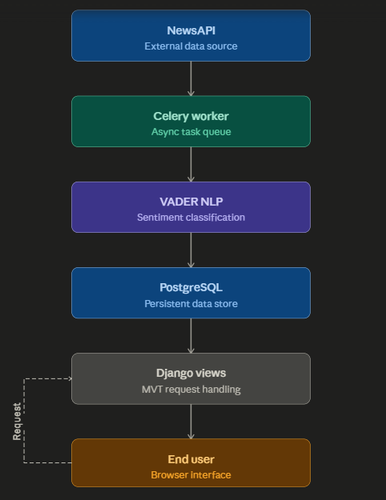

# News Aggregator with Sentiment Analysis

A production-grade full-stack web application that aggregates real-time news articles from global sources and performs automated sentiment classification using Natural Language Processing (NLP).

## 🔗 Live Demo

➡️ **https://sentiment-news-ajit.onrender.com**

---

## 📋 Project Overview

This platform demonstrates end-to-end implementation of a data pipeline that:
- Ingest news data from external APIs (NewsAPI)
- Process and classify content using NLP techniques
- Persist structured data in a relational database
- Serve dynamic content through RESTful Django views
- Schedule automated background tasks for continuous data updates

## 🛠 Tech Stack

| Component | Technology |
|-----------|------------|
| **Framework** | Django 5.x |
| **Language** | Python 3.11 |
| **Task Queue** | Celery 5.x with Redis broker |
| **NLP Engine** | NLTK VADER (Valence Aware Dictionary) |
| **Database** | PostgreSQL (Production) / SQLite (Development) |
| **Caching** | Redis with django-redis |
| **Server** | Gunicorn + WhiteNoise |
| **Deployment** | Render (PaaS) |

## 🏗 Architecture



## 🔬 Technical Implementation

### 1. Data Model (Django ORM)
```python
class NewsArticle(models.Model):
    title: CharField(255)
    description: TextField
    url: URLField (unique)
    source_name: CharField(100)
    published_at: DateTimeField (indexed)
    sentiment: CharField(10) - Positive/Negative/Neutral
```
- Database indexes on `published_at` and `sentiment` for query optimization
- Unique constraint on `url` prevents duplicate articles

### 2. Sentiment Analysis (NLP)
- **Algorithm**: VADER (Valence Aware Dictionary and sEntiment Reasoner)
- **Method**: Rule-based lexical approach with compound score calculation
- **Thresholds**: 
  - Compound ≥ 0.05 → Positive
  - Compound ≤ -0.05 → Negative
  - Otherwise → Neutral
- Processes article descriptions (truncated to 1000 chars for performance)

### 3. Background Task Scheduling
- **Celery Beat** scheduler runs every 5 minutes
- Fetches articles within last 24 hours
- Uses `get_or_create()` for idempotent database operations
- Exponential retry with 60-second countdown on failure

### 4. API Integration
- **NewsAPI.org** for news aggregation
- RESTful endpoints: `everything` endpoint with query parameters
- Date range filtering: last 3 days by default
- Response parsing with error handling and timeout (30s)

### 5. Caching Strategy
- Redis cache backend for query optimization
- Django cache framework integration
- Reduces database hits for repeated queries

---

## 💻 Local Development Setup

```bash
# Clone repository
git clone https://github.com/yourusername/SentimentNews.git
cd SentimentNews

# Create virtual environment
python -m venv .venv
source .venv/bin/activate  # Linux/Mac
.venv\Scripts\activate     # Windows

# Install dependencies
pip install -r requirements.txt

# Setup environment
cp .env.example .env

# Add API key (get from https://newsapi.org)
# NEWS_API_KEY=your_api_key

# Run migrations
python manage.py migrate

# Start development server
python manage.py runserver
```

### Running Background Workers

```bash
# Terminal 1: Django web server
python manage.py runserver

# Terminal 2: Celery worker
celery -A core worker -l info --pool=solo

# Terminal 3: Celery Beat scheduler
celery -A core beat -l info --schedule=/app/celerybeat-schedule
```

---

## ⚙️ Environment Variables

| Variable | Description | Required |
|----------|-------------|----------|
| `NEWS_API_KEY` | API key from newsapi.org | Yes |
| `SECRET_KEY` | Django secret key | Yes |
| `DEBUG` | Debug mode (True/False) | No |
| `DATABASE_URL` | PostgreSQL connection string | Production |
| `REDIS_URL` | Redis connection URL | No |
| `CELERY_BROKER_URL` | Celery broker URL | No |
| `NEWS_QUERY` | News search query (default: india) | No |

---

## 📊 Key Features Implemented

- ✅ Real-time news fetching from 50+ global sources
- ✅ Automated sentiment classification (Positive/Negative/Neutral)
- ✅ Celery Beat periodic task scheduling (5-minute intervals)
- ✅ Search and filter functionality
- ✅ Pagination for article listings
- ✅ Responsive dashboard UI
- ✅ Custom error pages (404/500)
- ✅ Redis caching
- ✅ Production deployment ready (Whitenoise, Gunicorn)
- ✅ PostgreSQL support

---

## 📄 License

MIT License